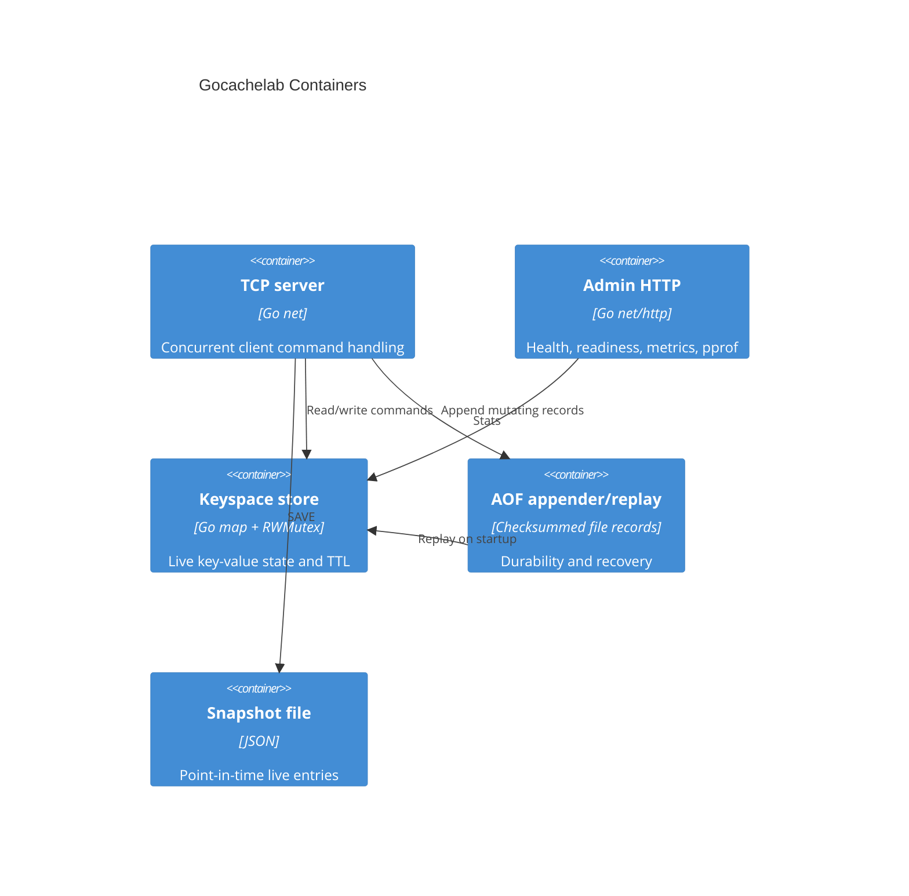

# C4 Container

```mermaid
C4Container
  title Gocachelab Containers
  Container(tcp, "TCP server", "Go net", "Concurrent client command handling")
  Container(admin, "Admin HTTP", "Go net/http", "Health, readiness, metrics, pprof")
  Container(store, "Keyspace store", "Go map + RWMutex", "Live key-value state and TTL")
  Container(aof, "AOF appender/replay", "Checksummed file records", "Durability and recovery")
  Container(snapshot, "Snapshot file", "JSON", "Point-in-time live entries")

  Rel(tcp, store, "Read/write commands")
  Rel(tcp, aof, "Append mutating records")
  Rel(tcp, snapshot, "SAVE")
  Rel(admin, store, "Stats")
  Rel(aof, store, "Replay on startup")
```

