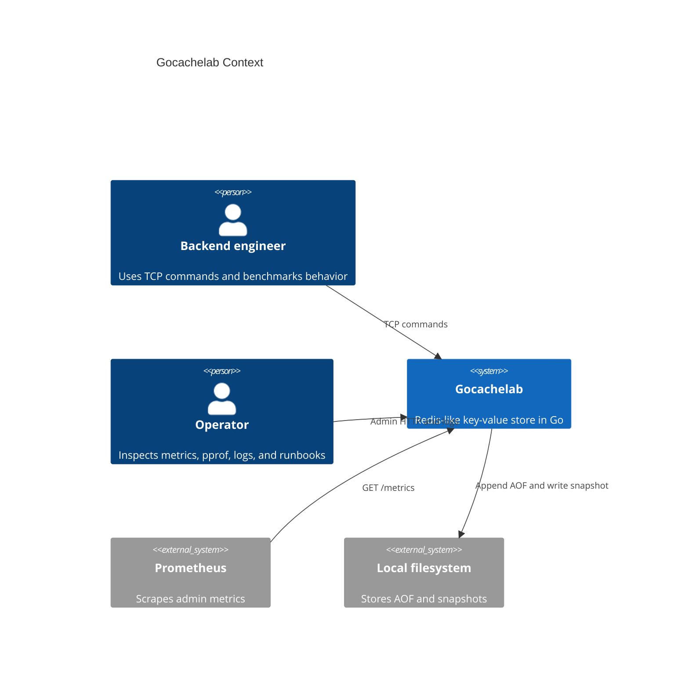

# C4 Context

```mermaid
C4Context
  title Gocachelab Context
  Person(engineer, "Backend engineer", "Uses TCP commands and benchmarks behavior")
  Person(operator, "Operator", "Inspects metrics, pprof, logs, and runbooks")
  System(gocachelab, "Gocachelab", "Redis-like key-value store in Go")
  System_Ext(prometheus, "Prometheus", "Scrapes admin metrics")
  System_Ext(filesystem, "Local filesystem", "Stores AOF and snapshots")

  Rel(engineer, gocachelab, "TCP commands")
  Rel(operator, gocachelab, "Admin HTTP and logs")
  Rel(prometheus, gocachelab, "GET /metrics")
  Rel(gocachelab, filesystem, "Append AOF and write snapshot")
```

