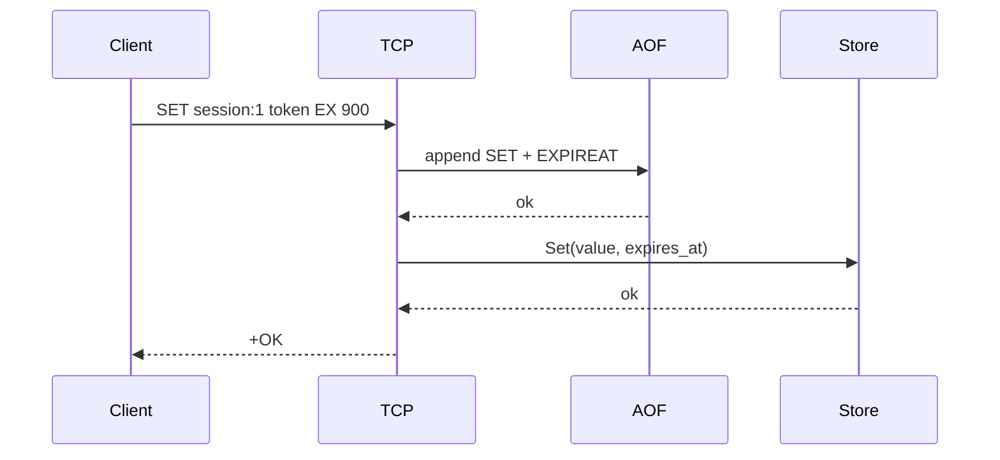
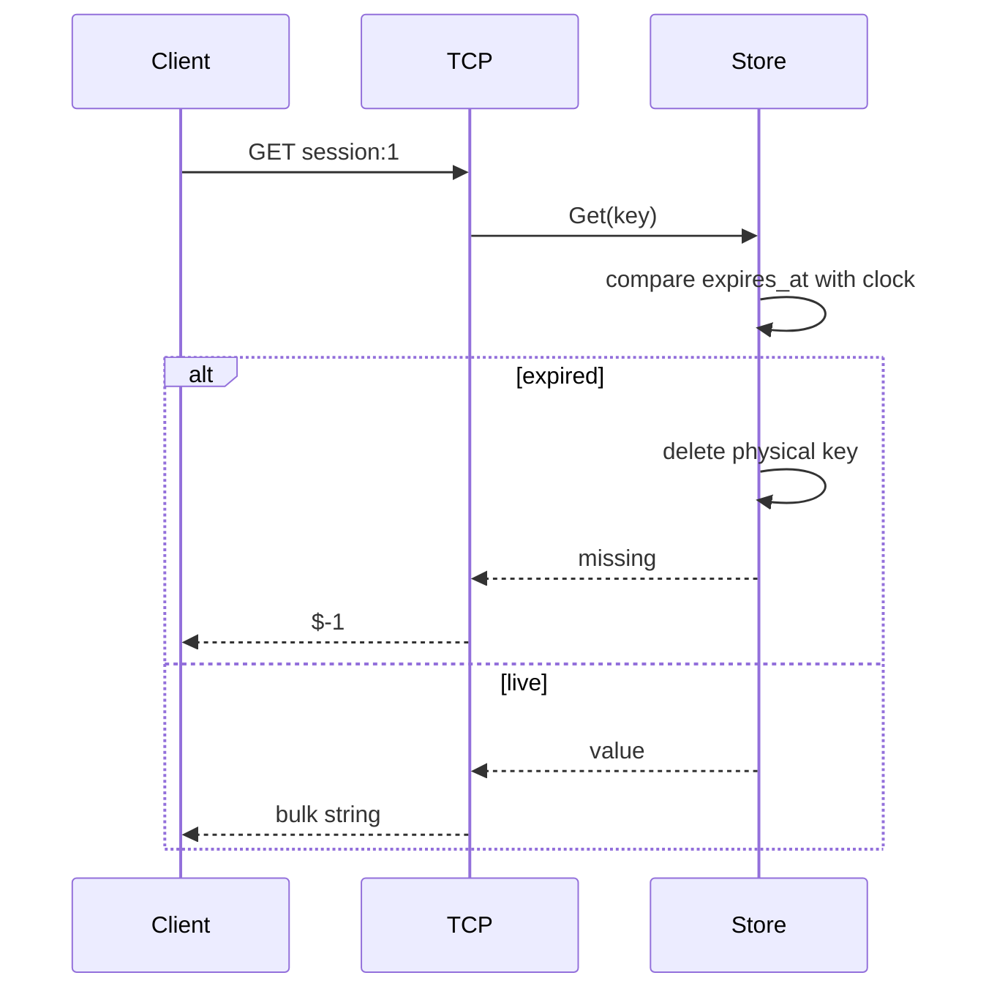
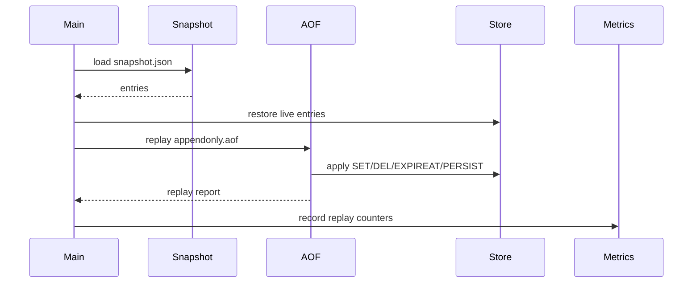

# Sequence Diagrams

## SET With TTL

```mermaid
sequenceDiagram
  participant Client
  participant TCP
  participant AOF
  participant Store

  Client->>TCP: SET session:1 token EX 900
  TCP->>AOF: append SET + EXPIREAT
  AOF-->>TCP: ok
  TCP->>Store: Set(value, expires_at)
  Store-->>TCP: ok
  TCP-->>Client: +OK
```

## GET With Lazy Expiration

```mermaid
sequenceDiagram
  participant Client
  participant TCP
  participant Store

  Client->>TCP: GET session:1
  TCP->>Store: Get(key)
  Store->>Store: compare expires_at with clock
  alt expired
    Store->>Store: delete physical key
    Store-->>TCP: missing
    TCP-->>Client: $-1
  else live
    Store-->>TCP: value
    TCP-->>Client: bulk string
  end
```

## Startup Recovery

```mermaid
sequenceDiagram
  participant Main
  participant Snapshot
  participant AOF
  participant Store
  participant Metrics

  Main->>Snapshot: load snapshot.json
  Snapshot-->>Main: entries
  Main->>Store: restore live entries
  Main->>AOF: replay appendonly.aof
  AOF->>Store: apply SET/DEL/EXPIREAT/PERSIST
  AOF-->>Main: replay report
  Main->>Metrics: record replay counters
```

