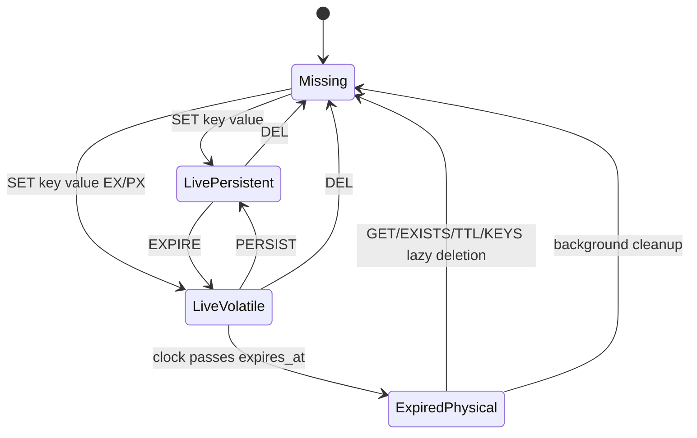
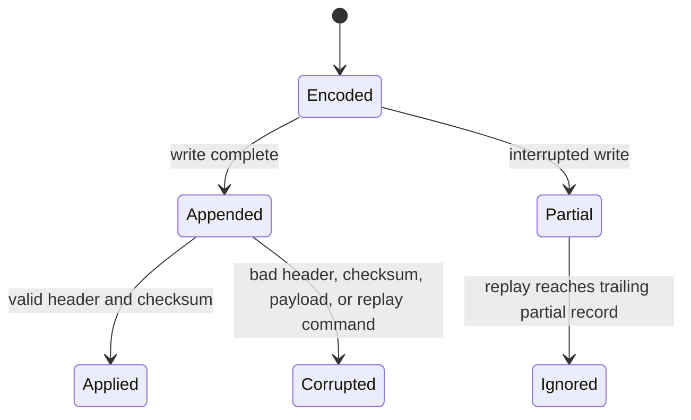

# State Machines

## Key Entry Lifecycle

```mermaid
stateDiagram-v2
  [*] --> Missing
  Missing --> LivePersistent: SET key value
  Missing --> LiveVolatile: SET key value EX/PX
  LivePersistent --> LiveVolatile: EXPIRE
  LiveVolatile --> LivePersistent: PERSIST
  LivePersistent --> Missing: DEL
  LiveVolatile --> Missing: DEL
  LiveVolatile --> ExpiredPhysical: clock passes expires_at
  ExpiredPhysical --> Missing: GET/EXISTS/TTL/KEYS lazy deletion
  ExpiredPhysical --> Missing: background cleanup
```

## AOF Record Lifecycle

```mermaid
stateDiagram-v2
  [*] --> Encoded
  Encoded --> Appended: write complete
  Encoded --> Partial: interrupted write
  Appended --> Applied: valid header and checksum
  Appended --> Corrupted: bad header, checksum, payload, or replay command
  Partial --> Ignored: replay reaches trailing partial record
```

